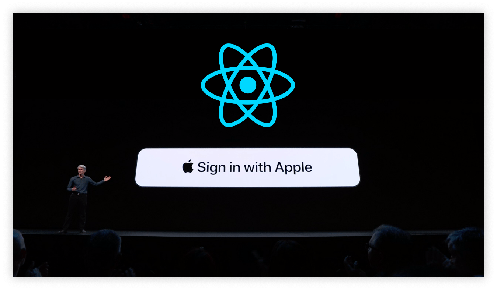

## An in-depth guide to Sign in with Apple using React Native
Greetings, React Native Community! 
<br /> In this article, I will be breaking down the step-by-step process of integrating Apple Sign-in using React Native.

### Why do I need to do this?

As per App Store's latest guidelines, it is now compulsory to add sign in with Apple in your iOS app if you're using any other social logins like Google, Facebook, Twitter, etc.

Moreover, if you already have an established app, Sign-in with Apple might help you gain more iOS users who might not want to sign in using other options.

### Steps:

* Apple Developer dashboard setup
* Adding the capability to our project
* Integrating React Native package

For the purpose of the demonstration, suppose we created a fresh React Native project called `Proximity` with bundleId `com.proximity.app`

#### Apple Developer dashboard setup

* Head over to [Apple's developer console](https://developer.apple.com/). Click `Account` in the nav bar at the top and sign in with your developer account.


* Your account dashboard should look like this. If you do not see `Certificates, IDs & profiles` as an option in the left-hand sidebar, it means you have not yet enrolled in the [Apple developer program](https://developer.apple.com/programs/) which is a prerequisite for Apple product development.


* Click on `Identifiers` in the left-hand sidebar. Click on your project bundleId in the list, in our case, `com.proximity.app`


* Tick the checkbox for `Sign in with Apple` and click the `Edit` button.


* Select `Enable as a primary App ID` and click the `Save` button.


* Click the `Save` button at the top of the screen.


*  If you're enabling for the first time then choose the `Group with existing primary App ID` option and then select your app ID from the drop-down.

* Click on `keys` in the left-hand sidebar and create a new key.


* Give your new key a descriptive name, something like `Apple sign in key for XYZ` where XYZ can be your app. Tick the checkbox next to `Sign In with Apple`, and click `Configure`.


* Select `Proximity` as our primary app ID.


* Register your key (My advice is to download and keep it securely). The initial setup for Apple sign in from the developer dashboard is now complete.


#### Adding the capability to our project

Before we start tinkering with our project, let's enable sign in with Apple capability for our app. Here I am using Xcode 11 for demonstration.

* Open your project in Xcode by clicking `Open another project` and navigate to the file: `Proximity/ios/Proximity.xcworkspace` or `Proximity/ios/Proximity.xcodeproj` 


* Click `Proximity` under the target's header on the left as shown below and then select `Signing and Capabilities` on the top tab bar.


* Click on `+ capability` to add a new capability. Now you should see a dialog. Select `Sign In with Apple` to enable this capability.


* Make sure to select your team and verify that this screen looks similar to one given below without any error.


#### Integrating React Native package

Phew!! 
<br /> Finally, we can start with the actual code.
<br /> For this section, we'll be using React Native 0.60+ and [@invertase/react-native-apple-authentication](https://github.com/invertase/react-native-apple-authentication) by [Invertase](http://invertase.io/). They're the team behind [react-native-firebase](https://github.com/invertase/react-native-firebase), do check them out!

* Let's add [@invertase/react-native-apple-authentication](https://github.com/invertase/react-native-apple-authentication) to our project.

``` 
yarn add @invertase/react-native-apple-authentication
```

* Update the cocoapods dependencies.

``` 
cd ios && pod install && cd ..
```

* Now we'll be implementing a simple screen with login and logout button to see the whole process in action.


* Here's how the basic code setup might look like.


* To perform a login request, we can use [performRequest](https://github.com/invertase/react-native-apple-authentication/blob/master/docs/interfaces/_lib_index_d_.rnappleauth.module.md#performrequest) method with [requestedOperation](https://github.com/invertase/react-native-apple-authentication/blob/master/docs/interfaces/_lib_index_d_.rnappleauth.appleauthrequestoptions.md#optional-requestedoperation) to perform `Login | Logout | Implicit | Refresh` requests. We can also request basic information from the user using [requestedScopes](https://github.com/invertase/react-native-apple-authentication/blob/master/docs/interfaces/_lib_index_d_.rnappleauth.appleauthrequestoptions.md#optional-requestedscopes) option as shown in the example below.


* Similar to the login request, we can just change [requestedOperation](https://github.com/invertase/react-native-apple-authentication/blob/master/docs/interfaces/_lib_index_d_.rnappleauth.appleauthrequestoptions.md#optional-requestedoperation) to `AppleAuthRequestOperation.LOGOUT`. Here's an example for logging out the user.


* Listen to the credentials revoked event using `useEffect` hook. This is useful when you want to actively listen if the user logs out.


Check out the [complete code](https://github.com/karanpratapsingh/guides-and-articles/blob/master/Articles/Sign%20in%20with%20apple/code%20snippets/AppleLogin.tsx) on Github for the example to get started faster.

I hope all the steps worked and you gained an understanding of how to integrate Apple sign in with React Native. <br />
If you wish to see this live in action check out [Proximity](https://github.com/karanpratapsingh/Proximity) where I recently implemented Apple Sign in.

<i>Did you face any issues during the integration? feel free to leave a comment or reach out to me via [twitter](https://twitter.com/karan_6864)</i>

Happy Coding! 🎉